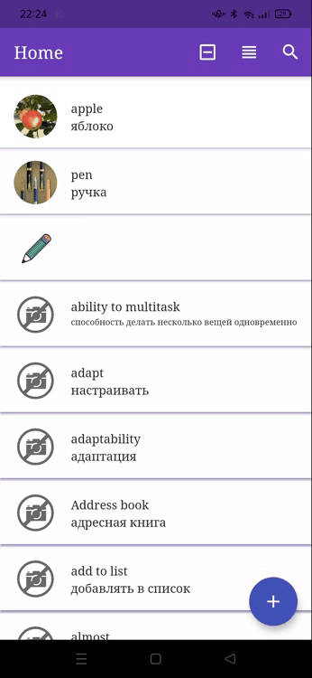

## What is it?

It's my education project for understanding Flutter and BLOC flow.  
The main application purpose is to have a dictionary with translation and picture. Application have quizlet-like animation and similar interfase. Thank you for visiting this page.

## Features

- [x] Animated cards (quizlet-like);  
  

- [x] Swiped cards (quizlet-like);  
  

- [x] LongPress preview (instagram-like);  
  

- [x] EN translation to word;  
  

- [x] RU manual translation to word;
- [x] Add picture to word;  
  

- [ ] Ability to work without server configuration (not working now)
- [x] Sync input validation;  
  

- [x] Word card;  

  

- [x] Update picture;  
  

- [x] Save words to DB;
- [x] Store key-value settings;
- [x] Search by word/translation;  
  

- [x] Layout and colors;
- [x] Two render list variations;  
  

- [x] Long list performance;  
  

- Animations;
  - [x] AnimatedOpacity;
  - [x] AnimatedContainer;
  - [x] Hero Animation;
  - [x] Rotate Anomation;
- [ ] Readme:
  - how its work;
  - architecture scheme;

## Builds

Most likely you can not start my project, because that have some secret API keys, that I have not commited.  
Fortunately I created build apk (android only) and shared it by farebase distribution. I will share it for show how it work in real device. If you want to get it please contact me by dev.zakharov.dy@gmail.com.

Unfortunitely I can't build application for iOS, because I can't register account and get error: "Your enrollment in the Apple Developer Program could not be completed at this time." on developer apple site. In emulator iOS application version works great.

## State management and architecture

- [bloc - a predictable state management library for Dart](https://bloclibrary.dev/#/)
- [About separation of responsibility and architecture](https://bloclibrary.dev/#/architecture)
- [Todos tutorial, that was used as foundation for data flow](https://bloclibrary.dev/#/fluttertodostutorial)

## Build process

- add `android/app/upload-keystore.jks`
- run `flutter clean && flutter build apk --no-sound-null-safety --split-per-abi`

## Settings

- for Android Studio: Run -> Edit Configuration -> Addition Run Args -> `--no-sound-null-safety` (because I use some non null safety libraries)
- add keys to `secret.env` in root directory.
